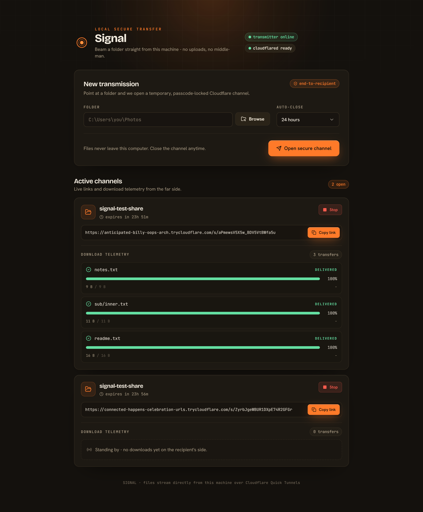
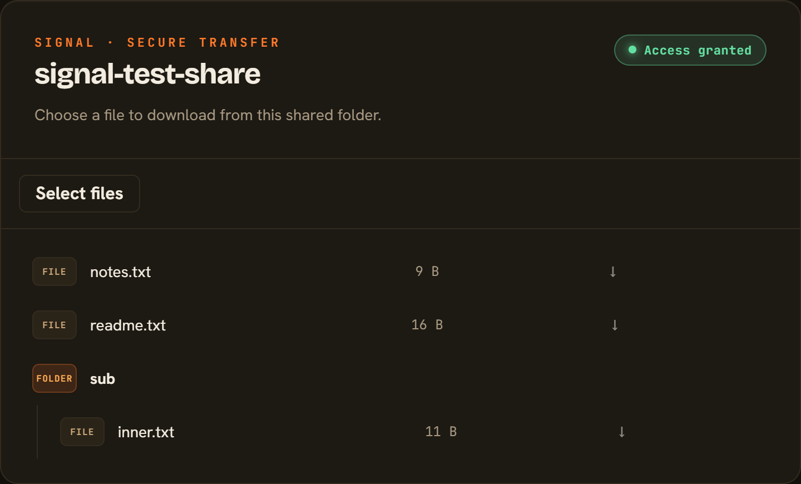
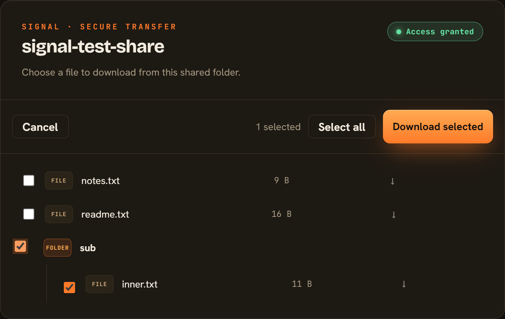

# Signal - Folder Share Dashboard

[](https://github.com/HindzSight/Signal/releases/latest)
[](LICENSE)

Beam a folder straight from your computer to anyone, through a temporary,
passcode-protected Cloudflare Quick Tunnel - and watch their downloads in real
time. Files are never uploaded to this app or any storage provider; they stream
directly off your disk while the tunnel is open.

Signal is free and open source. **[Download the desktop app](https://github.com/HindzSight/Signal/releases/latest)**
for Mac or Windows and start sharing in a minute - no separate `cloudflared`
install needed, it's bundled in.

> 📖 **Just want to run it?** See **[RUNNING.md](RUNNING.md)** for a step-by-step
> local setup guide.

## Screenshots

| Sender dashboard | Recipient page |
|---|---|
|  |  |

Recipients can also select multiple files (or a whole folder) and download them all at once:



## How it works

- A local **Node HTTP server** (`src/`) spawns `cloudflared`, opens the native OS
  folder picker, streams files with HTTP range/resume support, and pushes live
  transfer telemetry over Server-Sent Events.
- The **dashboard UI** (`frontend/`) is a Vite + React + TypeScript app built on
  [shadcn/ui](https://ui.shadcn.com) (new-york style) with a custom "SIGNAL"
  theme. The Node server serves the built app to you locally; your recipients
  only ever see the server-rendered `/s/<id>` share pages through the tunnel.

## Desktop app (Mac / Windows / Linux)

Signal also ships as a native Electron app with `cloudflared` bundled inside,
so there's nothing separate to install - download, open, choose a folder.

- **Download**: grab the latest installer from the
  [Releases page](https://github.com/HindzSight/Signal/releases):
  - **Mac, Apple Silicon (M1/M2/M3/M4/M5)**: `Signal-x.y.z-arm64.dmg`
  - **Mac, Intel**: `Signal-x.y.z.dmg` (no `arm64` in the name)
  - **Windows**: `Signal Setup x.y.z.exe`
  - **Linux**: `Signal-x.y.z.AppImage` - `chmod +x` it, then run it directly;
    no installation step needed.

  Picking the wrong Mac build still works via Rosetta 2 translation, just
  slower - use the `arm64` one if you're on an M-series chip.
- **Unsigned builds**: these aren't code-signed (no Apple/Windows developer
  certificate), so the OS will warn on first launch.
  - **Windows**: SmartScreen shows "unknown publisher" - click **More info** >
    **Run anyway**.
  - **Mac**: right-click the app > **Open** > **Open** again. If macOS instead
    says *"Signal" is damaged and can't be opened* - this is Gatekeeper being
    stricter about unsigned Apple Silicon builds than the older "unidentified
    developer" prompt, not an actually corrupted download. Open Terminal and run:
    ```bash
    xattr -cr /Applications/Signal.app
    ```
    (or wherever you moved the app), then open it again. This strips the
    quarantine flag the browser attached to the download.

  This is a one-time step per machine.
- **Build it yourself** instead of downloading:
  ```bash
  npm ci
  npm run icons                                       # only needed once, or after changing build/icon.png
  node scripts/fetch-cloudflared.mjs win32-x64         # or: darwin-x64 darwin-arm64 / linux-x64
  npm run electron:build:win                           # or: electron:build:mac / electron:build:linux
  ```
  Installers land in `release/`.
- **Cutting a release**: push a version tag and GitHub Actions builds all
  three platforms and attaches them to a new Release automatically -
  see [`.github/workflows/release.yml`](.github/workflows/release.yml).
  ```bash
  git tag v0.2.0 && git push origin v0.2.0
  ```

## Requirements

- Node.js 20+
- [cloudflared](https://developers.cloudflare.com/cloudflare-one/connections/connect-networks/downloads/)
  installed and available on `PATH` (not needed for the desktop app above, which bundles it)

## Run

Build the dashboard once, then start the server:

```powershell
# Windows (PowerShell)
npm.cmd run build   # installs frontend deps + builds frontend/dist
npm.cmd start       # serves the dashboard at http://127.0.0.1:8787
```

```bash
# macOS / Linux
npm run build   # installs frontend deps + builds frontend/dist
npm start       # serves the dashboard at http://127.0.0.1:8787
```

Open `http://127.0.0.1:8787`, choose a folder, open a secure channel, and send
the public link and passcode **separately**. Closing the service stops every share.

> If `frontend/dist` is missing (you skipped the build), the server automatically
> falls back to the lightweight inline dashboard - nothing breaks.

## Develop the UI

Run the backend and the Vite dev server (with hot reload) side by side:

```powershell
# Windows (PowerShell)
npm.cmd start          # terminal 1 - backend on :8787
npm.cmd run dev:ui     # terminal 2 - Vite on http://127.0.0.1:5173
```

```bash
# macOS / Linux
npm start          # terminal 1 - backend on :8787
npm run dev:ui     # terminal 2 - Vite on http://127.0.0.1:5173
```

Vite proxies `/api`, `/s/`, and the recipient stylesheet to the backend, so the
dev server behaves exactly like production.

## Security notes

- The dashboard binds only to loopback. Public file pages are reachable only
  through the Cloudflare tunnel, and only after the recipient enters the passcode.
- Passcodes are stored as a salted scrypt hash; sessions are HMAC-signed cookies.
- File requests are path-contained and reject symlinks that escape the shared folder.

## Test

```powershell
npm.cmd test    # Windows (PowerShell)
```

```bash
npm test        # macOS / Linux
```

## Contributing

Bug reports, feature ideas, and PRs are welcome - see
[CONTRIBUTING.md](CONTRIBUTING.md) for how the project is laid out, coding
conventions, and what to check before opening a PR.

## License

[MIT](LICENSE) - © 2026 Manan Jain
